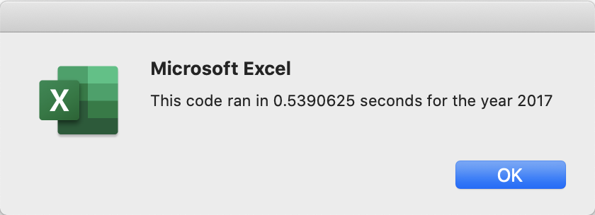
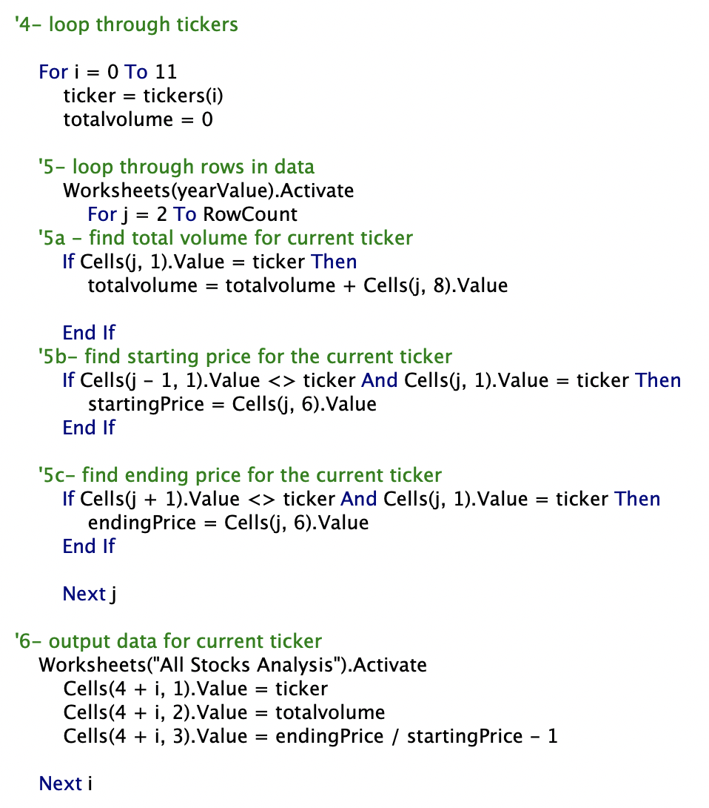

# Overview of Project
  This analysis of total volumes and the differences in stock start and end prices was done on green energy stocks to inform investment decisions by looking at performance between 2017 and 2018.

## Results 
Overall, the green energy market performed much better in 2017 than in 2018. This is clearly evident looking at the total return for stocks in each year as in the images below. This analysis was done in two ways by adjusting the loops of code. First, the code looked at all 3012 lines of code for each ticker to pull the total volume and return prices. This took .53 seconds. Then, the code was refactored to be significantly faster where the code ran through all 3012 rows, and checked each line for the corresponding ticker price. This took .10 seconds. Considering we only were looking at data for 12 stocks, this difference is significantly faster especially when thinking about applying this code to 100s of stock analysis. 

### 2017 and 2018 Total Volume and Stock Return for 12 Green Stocks

   

### Speed of Refactored vs. Original code

  These images show the difference in code run time and the variations in the loops of the code.
  
#### Refactored Code

    
  

  

#### Original Code

    

  

## Summary

### Refactoring Code

Refactoring code is advantagous to make analysis faster. This allows the analyst to re-purpose code that has already been used to make it run faster and make it simplier to read and be reused. The one downfall to refactoring code is that sometimes it takes some trial and error to repurpose longer codes into the correct format and not lose any data. For example, refactoring the green stocks analysis code allowed us to cut the code time by 80%, however it took time to get the proper loops the first time the code was refactored. 

### Refactoring VBA script
These advantages and disadvantages also apply to refactoring the original VBA script for the screen stocks analysis. The orginial green stocks code was simplier to follow with the single loop, however, the refactored code was worth the time to repurpose due to its improved run time and broader use for larger projects.

